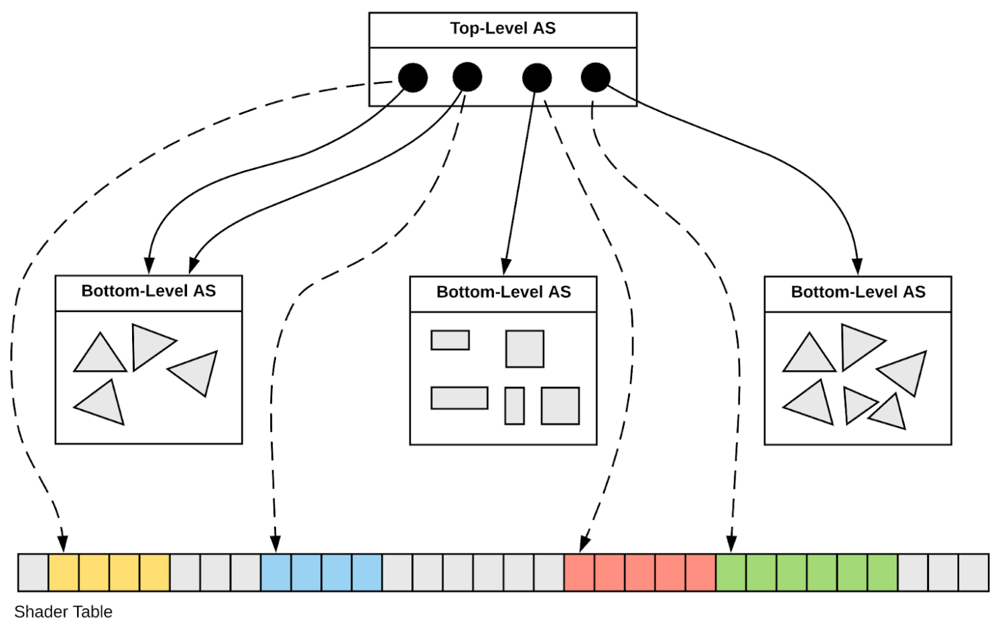
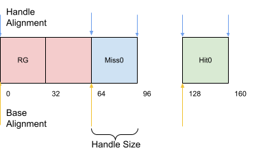
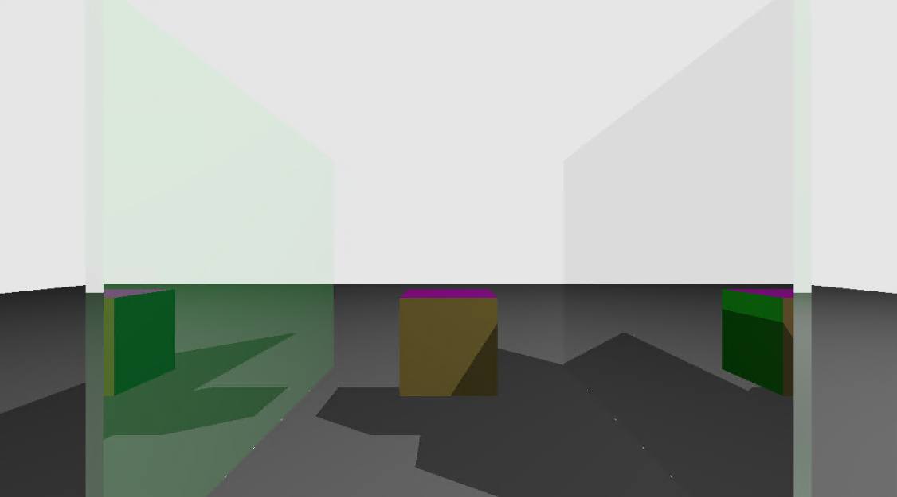
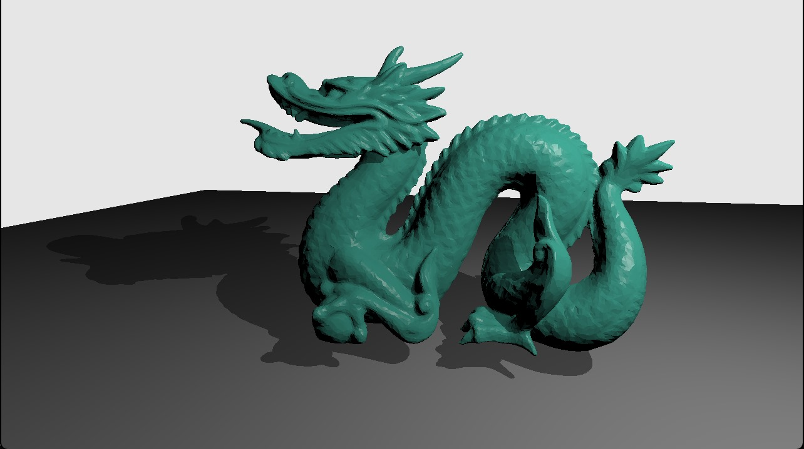
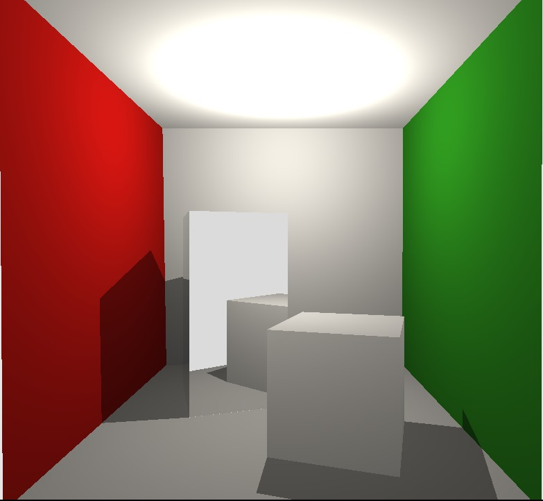

<iframe width="560" height="315" src="https://www.youtube.com/embed/7uJs2u7WHIc?si=lGwnaFBdAUgP3mMs" title="YouTube video player" frameborder="0" allow="accelerometer; autoplay; clipboard-write; encrypted-media; gyroscope; picture-in-picture; web-share" referrerpolicy="strict-origin-when-cross-origin" allowfullscreen></iframe>

# Computer Graphics II - Vulkan Ray Tracing

Traditional ray tracing methods are not hardware-accelerated. The ray generation and intersect tests are done manually. This leads to slowdowns when the scene contains many models or has a high primitive count.
Breakthroughs in modern graphics cards have led to the implementation of hardware ray tracing support. In this project, we demonstrate the advantages of using hardware ray tracing. The results show that performance is substantially higher compared
to previous approaches and that the implementation of ray tracing is simplified.

## Overview

Before explaining the specifics of hardware ray tracing, let's remember how we implemented CPU ray tracing in 477 HW1:

1. Loop through the pixels of the screen, emit one ray for each.
2. Cast each ray through the scene, check for intersections.
3. Handle reflections by casting rays from intersection points.
4. After intersection points are found, apply material equations and scene lights to get color output.

In hardware ray tracing, the above steps stay the same but the GPU 'helps' us with some of them.

## Acceleration Structures

In the above list, step 2 requires us to iterate through all the objects in the scene and run an intersection calculation for each. This becomes prohibitively expensive as the triangle count grows. On the CPU, BVH algorithm may be used to reduce the number
of intersection checks. The GPU ray tracing pipeline has a similar concept named acceleration structures. Before rendering the scene, these acceleration structures are generated using the mesh data. Then when an intersection query
result is needed during rendering, the shaders access this structure to get the required data.

The generation of acceleration structures is done in two steps:

### Bottom-Level AS Generation

1. For each model, get the vertex and index buffers.
2. Allocate scratch memory on the GPU to be used for generation.
3. Fill a command buffer with AC generation and compaction commands.
4. Send the command buffer for execution on the GPU.

### Top-Level AS Generation

1. For each model instance, fill out a VkAccelerationStructureInstanceKHR struct.
2. Fill command buffer with necessary commands.
3. Upload the filled structs to the GPU.
4. Mark command buffer for execution.

The bottom level AS keeps vertex and intersection data and the top level AS keeps material & transform data for each model instance.

<div style="display: flex;">
  
</div>

## Descriptor Sets

Descriptor sets are basically the Vulkan equivalent of OpenGL SSBOs. In the ray tracing shaders, we need to access the previously generated acceleration structures and the off-screen buffer to which we will be rendering. In order to do that, we need to create a descriptor set with that information. 

// TODO explain in detail

## Ray Tracing Pipeline

Traditional graphics pipelines are sequential. A list of stages is given to the GPU and a shader is executed in each of these stages. The final output image is then displayed on the screen. Ray tracing pipelines do not have this property as any shader
in the pipeline may be needed at any time. This is because of the nature of ray intersection. When a ray is cast from a location, it is not known in advance which object -or the skybox- it will hit. Any object's shader output may be needed to process that ray's bounce. To model this process, a separate stage is added to the pipeline for each 'state' of a ray. These stages are as follows:

1. Ray generation: The initial ray casting from the camera happens here
2. Ray miss: Called by the GPU when a ray doesn't hit anything
3. Ray hit: Called by the GPU when an intersection test succeeds

Additional optional stages may be used depending on the complexity of the program.

### Shader Binding Table

When a ray is traced on the GPU, the information on which shader to call of which object is provided by the shader binding table (SBT). This SBT is created on the CPU and is basically an array of function pointers with specific alignment rules.
The GPU uses the SBT as a lookup table to know which shader function to invoke for a given ray hit (or miss). There should be a region of the SBT for each stage of the RT pipeline.

<div style="display: flex;">
  
</div>

## Ray Tracing

After all of this initialization, we may finally fill a command buffer with the TraceRays command and bind our pipeline and descriptor sets:

```cpp
vkCmdBindPipeline(cmdBuf, VK_PIPELINE_BIND_POINT_RAY_TRACING_KHR, raytracing_pipeline);
vkCmdBindDescriptorSets(cmdBuf, VK_PIPELINE_BIND_POINT_RAY_TRACING_KHR, raytracing_pipeline_layout, 0,
                        (uint32_t)descSets.size(), descSets.data(), 0, nullptr);
vkCmdPushConstants(cmdBuf, raytracing_pipeline_layout,
                   VK_SHADER_STAGE_RAYGEN_BIT_KHR | VK_SHADER_STAGE_CLOSEST_HIT_BIT_KHR | VK_SHADER_STAGE_MISS_BIT_KHR,
                   0, sizeof(PushConstantRay), &m_pcRay);


vkCmdTraceRaysKHR(cmdBuf, &rgen_region, &miss_region, &hit_region, &call_region, vk_window_size.width, vk_window_size.height, 1);
```

When the above command finishes execution, the image buffer will have the ray-traced scene pixel values. We do astandard post-process gamma correction and display the result.

### Materials & Textures

Up until this point we have been focused on the casting & bouncing of rays in the scene. Additionally, we need to know the materials of each object when a ray hits. In the hit shader of the pipeline, we are given gl_PrimitiveID which represents which triangle of the object was hit, and gl_InstanceCustomIndexEXT which represents the object that was hit. Using these two pieces of information we can figure out the exact location that was hit. This allows us to calculate the position and normal of the hit location. After we get the position and normal, we may proceed to do the traditional material and texture lookups.

### Reflection

Reflection is handled using pseudo-recursion in the ray generation shader. Refer to the comments in the shader snippet below.

```cpp
for(;;)
{
  // Here is the calling other shaders part
  traceRayEXT(topLevelAS,     // acceleration structure
              rayFlags,       // rayFlags
              0xFF,           // cullMask
              0,              // sbtRecordOffset
              0,              // sbtRecordStride
              0,              // missIndex
              origin.xyz,     // ray origin
              tMin,           // ray min range
              direction.xyz,  // ray direction
              tMax,           // ray max range
              0               // payload (location = 0)
  );
  hitValue += prd.hitValue * prd.attenuation;
  
  prd.depth++;

  // Here we check the done condition that may be set by the hit or miss shaders
  // For example the hit shader will set done=0 if a reflective material is hit,
  // allowing for one more bounce.
  if(prd.done == 1 || prd.depth >= pcRay.maxDepth)
    break;

  // Bounce with payload results
  origin.xyz    = prd.rayOrigin;
  direction.xyz = prd.rayDir;

  prd.done      = 1;  // If done is 1 the recursion will stop
}
```

## Gallery

<div style="display: flex;">
  
</div>

<div style="display: flex;">
  
</div>

<div style="display: flex;">
  
</div>

## Programming Details

We used NVIDIA-specific Vulkan Ray Tracing extension library to make the issuance of RT commands easier. For obj file loading, we use the standard header-only library tinyobjloader.
GLM and GLFW play their original roles. 

## Interesting Remarks

### host_device.h

In order to avoid redefining data structures that are shared between the GPU and CPU, we borrowed a strategy from NVIDIA DesignWorks. The strategy is to use clever macros and include the same file in both main.cpp and the shaders:

```cpp
// These usings are used to share vector types between GLSL and C++
#ifdef __cplusplus
#include <glm/glm.hpp>
// GLSL Type
using vec2 = glm::vec2;
using vec3 = glm::vec3;
using vec4 = glm::vec4;
using mat4 = glm::mat4;
using uint = unsigned int;
#endif

// For example, an UBO may then be defined as follows:
struct PushConstantRay
{
  vec4  clearColor;
  vec3  lightPosition;
  float lightIntensity;
  int   lightType;
  int   maxDepth;
};
// In C++ the vec4's will become glm::vec4.

```

## Performance 

### Comparison with OpenGL Ray Tracer
